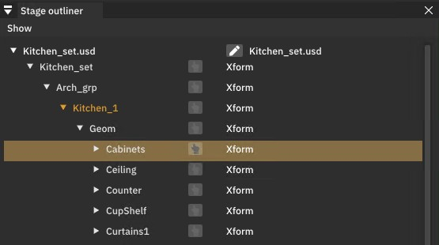

# Layer vs Stage

To effectively use usdtweak, it's important to understand the difference between operating on a layer level and on a stage level.

Consider loading a USD file (which is technically always a layer) that contains sublayers, references, and payloads. The following illustration shows how the same file is treated when opened as a layer versus as a stage.

A layer is basically a file, it may contain some data (prims) and links to other files (such as sublayers, references, and payloads). A stage, on the other hand, represents a composed scene in memory. It resolves the various layers (sublayers, references, payloads...) and their data into a final structure based on the USD [composition system](https://openusd.org/release/glossary.html#composition), adhering to their [stregth ordering](https://openusd.org/release/glossary.html#livrps-strength-ordering).

Here is how these concepts are applied in usdtweak :

## Layer

Opening a file as a layer will not display anything in the viewport. However, you can directly access the data inside the file in the "Layer Hierarchy" window.

Just like in a text editor, anything that links to external files will appear as links, or in USD terms, "composition arcs." You can edit any prim present in your layer using the "Layer Property Editor" window.

## Stage

When opening as a stage, the first thing you'll notice is that your objects will appear in the viewport (if present).

You can select your objects/prims directly in the viewport or in the "Stage Outliner."

Any selected prim can be edited in the "Stage Property Editor."

